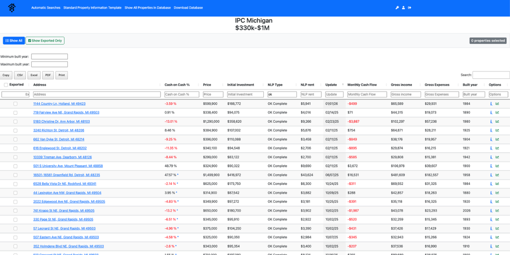
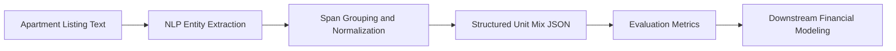

# Real Estate Unit Mix Extraction
Applied NLP project demonstrating entity extraction, dataset design, and evaluation for messy domain specific text.

Extract structured unit mix data from unstructured apartment listing descriptions.

This project demonstrates an applied NLP system that converts messy real estate listing text into structured data used for financial modeling, underwriting, and portfolio analysis.

The repository focuses on problem framing, dataset design, labeling strategy, modeling approach, and evaluation methodology.

The production system includes additional components that are intentionally not included here.

---

## Workflow Example

This screenshot shows how structured output from listing text can be used inside a real underwriting and screening workflow.

Instead of leaving unit mix details buried in unstructured listing descriptions, the system converts them into structured fields that can support faster review, filtering, and comparison across properties.



---

## Table of Contents

• [Problem](#problem)  
• [Example](#example)  
• [System Overview](#system-overview)  
• [Modeling Approach](#modeling-approach)  
• [Dataset and Labeling](#dataset-and-labeling)  
• [Evaluation](#evaluation)  
• [Repository Structure](#repository-structure)  
• [Running the Example Pipeline](#running-the-example-pipeline)  
• [Documentation](#documentation)  
• [What Is Intentionally Omitted](#what-is-intentionally-omitted)

---

## Problem

Apartment building listings frequently describe the **unit mix** inside free form text written by listing agents.

Examples may include phrases like:

20 one bedroom one bath  
5 two bedroom 1.5 bath

In many cases the unit mix appears inside longer paragraphs describing the property.

Because there is no standardized format, extracting reliable unit mix data at scale becomes difficult.

Structured unit mix data supports workflows such as

• rent estimation  
• underwriting models  
• automated financial projections  
• portfolio analysis

Back to top → [Table of Contents](#table-of-contents)

---

## Example

Input text

Four total units. Two units are 1 bedroom 1 bath. Two units are 2 bedroom 1 bath.

Structured output

```json
{
  "total_units": 4,
  "unit_mix": [
    { "count": 2, "beds": 1, "baths": 1 },
    { "count": 2, "beds": 2, "baths": 1 }
  ]
}
```

Back to top → [Table of Contents](#table-of-contents)

---

## System Overview



High level pipeline

Listing description text  
→ NLP entity extraction  
→ span grouping and normalization  
→ structured unit mix JSON  
→ rent estimation step  
→ downstream financial modeling

This repository focuses on the information extraction layer.

The rent estimation step is represented with a stub interface.

Example stub

• [unitmix_extractor/rent_estimator_stub.py](unitmix_extractor/rent_estimator_stub.py)

Back to top → [Table of Contents](#table-of-contents)

---

## Evaluation

Extraction quality is measured using three primary metrics.

Precision  
How often extracted unit attributes are correct.

Recall  
How often valid attributes are successfully captured.

Normalization Accuracy  
Whether the final structured unit mix correctly reflects the underlying listing information.

Future evaluation work will include benchmarking extraction performance across multiple listing styles including broker listings, marketing pages, and MLS descriptions.

---

## Modeling Approach

Primary production approach

• spaCy NER for entity extraction

This repository ships a safe stub model so the project runs without shipping production artifacts.

Stub model

• [unitmix_extractor/ner_stub.py](unitmix_extractor/ner_stub.py)

Post processing logic groups spans into structured unit mix data.

• [unitmix_extractor/postprocess.py](unitmix_extractor/postprocess.py)

Back to top → [Table of Contents](#table-of-contents)

---

## System Architecture

The extraction pipeline converts unstructured listing descriptions into normalized unit mix records.

High level flow

Listing Text  
↓  
Named Entity Extraction  
↓  
Unit Attribute Grouping  
↓  
Schema Validation  
↓  
Structured Unit Mix Output

### Key Components

Text Ingestion  
Collects listing descriptions from marketing pages and broker feeds.

Extraction Model  
Identifies candidate spans for bedrooms, bathrooms, and unit counts.

Normalization Layer  
Converts extracted values into standardized unit types.

Schema Validation  
Ensures output conforms to the defined structured schema.

Structured Output  
Clean unit mix records suitable for underwriting workflows.

---

## Dataset and Labeling

Annotation tool

Doccano sequence labeling.

Label set

• TOTUNIT  
• DETUNIT  
• TOTBED  
• DETBED  
• TOTBATH  
• DETBATH

Sample dataset included in this repository

• [data/sample_inputs.jsonl](data/sample_inputs.jsonl)  
• [data/sample_labels.jsonl](data/sample_labels.jsonl)

Back to top → [Table of Contents](#table-of-contents)

---

## Evaluation

Evaluation focuses on structured output quality rather than token level metrics.

Metrics used

• total unit exact match  
• unit mix exact match  
• unit mix overlap score

Evaluation script

• [unitmix_eval/evaluate.py](unitmix_eval/evaluate.py)

Back to top → [Table of Contents](#table-of-contents)

---

## Repository Structure

Key folders

data  
Sample input listings and synthetic labels

docs  
Design documentation and methodology

unitmix_extractor  
Core extraction pipeline

unitmix_eval  
Evaluation harness and scoring metrics

tests  
Basic smoke tests

Back to top → [Table of Contents](#table-of-contents)

---

## Running the Example Pipeline

Create environment

```bash
python -m venv .venv
source .venv/bin/activate
python -m pip install --upgrade pip
pip install -e .
pip install pytest
```

Run extraction on sample data

```bash
python cli.py data/sample_inputs.jsonl
```

Evaluate predictions

```bash
python unitmix_eval/evaluate.py --inputs data/sample_inputs.jsonl --labels data/sample_labels.jsonl
```

Run tests

```bash
python -m pytest -q tests
```

Back to top → [Table of Contents](#table-of-contents)

---

## Documentation

Additional design documentation

• [Problem Definition](docs/problem_definition.md)  
• [Output Schema](docs/output_schema.md)  
• [Dataset and Labeling Guide](docs/data_labeling_guide.md)  
• [Modeling Approach](docs/modeling_approach.md)  
• [Training Process](docs/training_process.md)  
• [Evaluation Plan](docs/evaluation_plan.md)  
• [Error Analysis](docs/error_analysis.md)  
• [What Is Omitted And Why](docs/whats_omitted_and_why.md)

Back to top → [Table of Contents](#table-of-contents)

---

## What Is Intentionally Omitted

This repository demonstrates design and evaluation without exposing business critical details.

The following are intentionally excluded

• deployed web application  
• infrastructure and hosting configuration  
• secrets or API keys  
• production scraping pipelines  
• full training datasets  
• trained model artifacts  
• external rent estimation provider details

---

## Connect

LinkedIn
https://www.linkedin.com/in/patrickimperato/

GitHub
https://github.com/PatrickImperato
